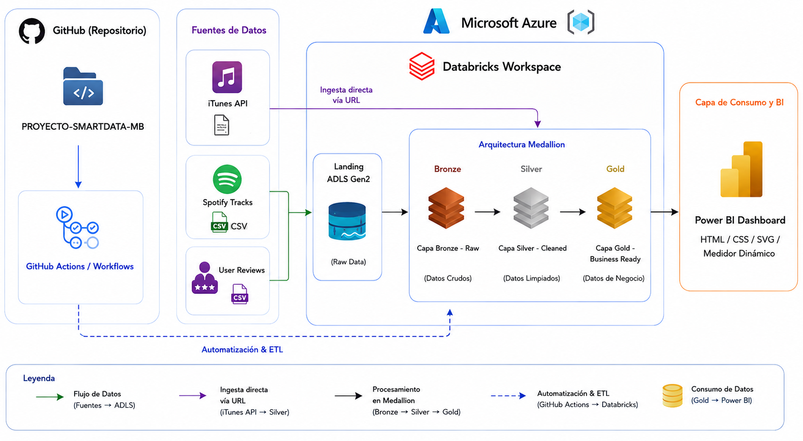

# 🎵 PROYECTO-SMARTDATA-MB: Music Data Engineering & Analytics Platform

Repositorio oficial para el **Proyecto Final del Curso de Ingeniería de Datos**. Este proyecto implementa una arquitectura de datos end-to-end (ingesta, transformación, modelado y visualización avanzada) utilizando datos de plataformas de streaming musical (**Spotify & Apple Music**).

---

## 🏗️ Arquitectura del Proyecto (Medallion Architecture)
El pipeline de datos está estructurado en capas dentro de Databricks utilizando Delta Lake:

1. **Bronze (Raw):** Ingesta cruda de datos provenientes de fuentes externas (canciones, géneros, reseñas de usuarios).
2. **Silver (Cleaned & Transformed):** Limpieza, normalización de tipos de datos, manejo de nulos y estructuración de tablas relacionales.
3. **Gold (Aggregated & Business Ready):** Modelado dimensional optimizado para consumo analítico (`gold_music_metrics`, `gold_music_segments`, `gold_reviews_metrics`).




---
## ¿Qué preguntas responde este proyecto?

**Análisis de Tendencias Musicales (Modelo Analítico · Power BI):**
- ¿Cuál es el volumen total de música y hits disponibles en el catálogo analizado?
- ¿Cómo se distribuye la popularidad promedio de las canciones según el género de iTunes?
- ¿Cuál es la duración promedio de las pistas musicales y qué géneros destacan?
- ¿Qué géneros musicales dominan el mercado de streaming según la cantidad de pistas y visualizaciones?

**Análisis de Sentimiento y Satisfacción (Reseñas de Usuarios):**
- ¿Cómo se comporta el sentimiento general de los usuarios (Positivo, Neutral, Negativo)?
- ¿Cuál es la calificación promedio de estrellas (`avg_rating`) y el volumen de interacciones (*thumbs up*) por categoría de sentimiento?
- ¿Cómo reacciona el medidor de satisfacción global ponderado ante los filtros aplicados en el dashboard?

---

## 📊 Componentes del Dashboard en Power BI
La capa de presentación ha sido desarrollada integrando **Power BI con código avanzado HTML, CSS y gráficos vectoriales (SVG)**, emulando la interfaz de usuario de aplicaciones de streaming líderes.


### Elementos Visuales Destacados:
* **Panel de KPIs Horizontales (Glassmorphism):** Barra superior con métricas clave (*Total Songs*, *Total Hits*, *Avg Popularity*, *Avg Duration*) con efectos de transparencia e íconos neón.
* **Medidor de Satisfacción (Gauge Dinámico):** Un velocímetro SVG interactivo con aguja rotatoria que calcula automáticamente el puntaje de satisfacción global ponderado (1.0 a 5.0) y distribución por sentimientos.
* **Tarjeta de Género Dinámica (Póster Vertical):** Componente visual tipo póster que cambia su imagen de fondo automáticamente según el género musical seleccionado (`itunes_genre`) mediante lógica condicional DAX (`SWITCH`).
* **Termómetro de Popularidad:** Barra de progreso dinámica que reacciona a los filtros del usuario mostrando categorías (*Alta*, *Media*, *Baja*).
* **Fondo Global Unificado:** Fondo oscuro con degradado verde Spotify implementado mediante una medida SVG-DAX para garantizar consistencia visual en todo el reporte.

---
El proyecto se encuentra organizado de la siguiente manera:

## Datos del Proyecto

| Métrica | Valor / Descripción |
|---|---|
| Fuentes de Datos | Spotify Tracks, Apple Music (iTunes API), Reseñas de Usuarios |
| Capas de Procesamiento | Medallion Architecture (Bronze ➔ Silver ➔ Gold) |
| Entidades Gold Principales | `gold_music_metrics`, `gold_music_segments`, `gold_reviews_metrics` |
| Herramientas de BI | Power BI (`.pbix`) con integración HTML/SVG vía DAX |
| Componentes Visuales Custom | KPIs Horizontales, Gauge Semicircular, Póster Dinámico por Género |
| Control de Reversión | Script SQL estructurado para rollback completo de objetos |

---

## Estructura del Repositorio

```text
PROYECTO-SMARTDATA-MB/
│
├── certificaciones/         # Credenciales y constancias técnicas (Databricks y Azure)
├── dashboard/               # Archivo Power BI (.pbix) y captura de vista previa del reporte
├── datasets/                # Archivos fuente (APIs, CSV de canciones y reseñas)
├── evidencias/              # Capturas del despliegue en Databricks, Jobs y Azure
├── PrepAmb/                 # Scripts de preparación inicial del entorno
├── proceso/                 # Notebooks secuenciales del pipeline de datos (Bronze -> Gold -> Grants)
├── reversion/               # Script SQL de rollback para limpieza total de objetos
│   └── drop_all_objects.sql
├── seguridad/               # Configuración de control de accesos y permisos
└── README.md                # Documentación principal del proyecto proyecto